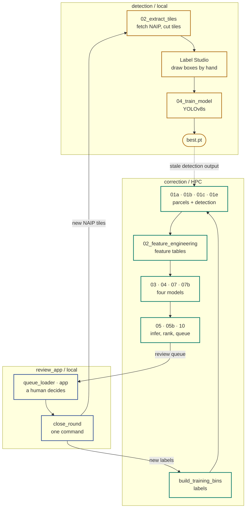

# tp_qa — CWNS Treatment Plant Location Correction

The EPA's Clean Watersheds Needs Survey collects self-reported locations for
wastewater treatment plants. Many are wrong. This project finds the wrong ones
and corrects them, using machine learning over parcel data, land cover, and
object detection on aerial imagery, with a human review loop that both
measures the models and permanently grows their training data.

## → [Start with the manual: `docs/README.md`](docs/README.md)

---

## How it fits together

**The loop is the point.** Each pass adds verified locations to the master
file and annotated tiles to the detector. Retraining the detector is optional
on any given pass — but a new `best.pt` invalidates every existing detection
output, so `01b`, `01c` and `01e` all have to re-run before
`02_feature_engineering`. `check_od_freshness.py` exists to catch exactly that.

**[→ The full pipeline map](docs/pipeline-map.html)** — four detailed diagrams
plus every argument of all 63 scripts. Open it in a browser; GitHub won't
render it inline.

---

## The three subsystems

| Directory | Runs on | Purpose |
|---|---|---|
| `detection/` | local | YOLOv8 object detection for wastewater infrastructure in NAIP imagery |
| `correction/` | HPC | The ML pipeline — four models, national inference |
| `review_app/` | local | Human review of model output; feeds verified locations back into training |

## Quick links

| I want to… | Go to |
|---|---|
| Understand what this is | [docs/01_ORIENTATION.md](docs/01_ORIENTATION.md) |
| Run something today | [docs/05_RUNBOOK.md](docs/05_RUNBOOK.md) |
| See the whole thing at once | [docs/pipeline-map.html](docs/pipeline-map.html) |
| Fix something that broke | [docs/06_TROUBLESHOOTING.md](docs/06_TROUBLESHOOTING.md) |
| Take this project over | [docs/08_HANDOFF.md](docs/08_HANDOFF.md) |

## A note on the documentation

The Python docstrings in this repo are design documents. They record *why*
decisions were made, including approaches that were tried and reversed, with
dates. When a docstring and a markdown file disagree, believe the docstring.

`docs/README.md` has a status table saying which of the older documents are
still current and which are historical.
